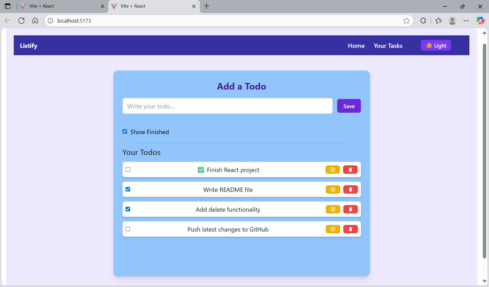
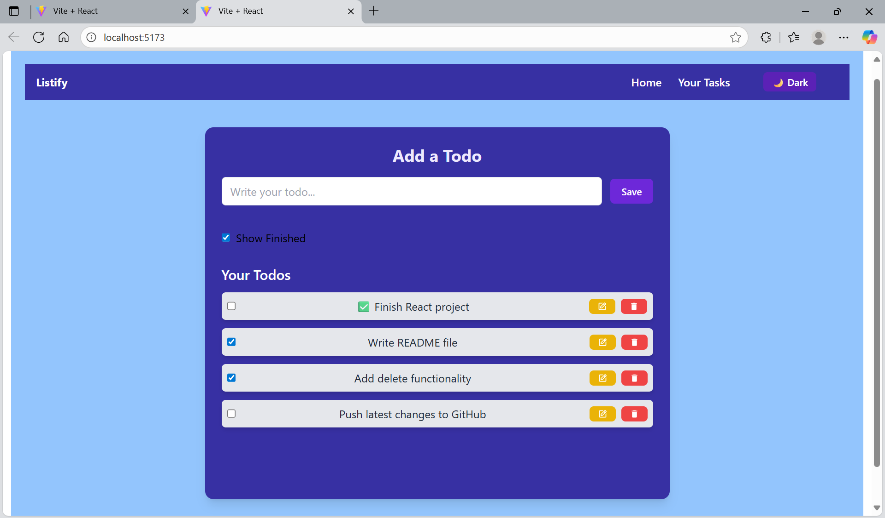

# Listify– Todo App
A responsive React To-Do app with add, edit, delete, mark complete/incomplete, filter finished tasks, and localStorage support.

## ✨ Features

**Add, edit, and delete todos

**Mark tasks as completed or pending

**“Show Finished” checkbox to filter completed items

**Dark/Light theme toggle

**Todos persist in the browser via localStorage

**Responsive UI with Tailwind CSS

## 🛠️ Tech Stack

- [React](https://react.dev/) (with Hooks)  
- [Tailwind CSS](https://tailwindcss.com/)  
- [React Icons](https://react-icons.github.io/react-icons/)  
- [Vite](https://vitejs.dev/) – for fast development and build  
- `uuid` – to generate unique IDs for todos

# 📂 Project Structure
Listify/
├── public/
├── screenshots/
│   ├── light.png
│   └── dark.png
├── src/
│   ├── assets/
│   ├── components/
│   │   └── Navbar.jsx
│   ├── App.jsx
│   ├── index.css
│   ├── main.jsx
│   ├── postcss.config.js
│   ├── tailwind.config.js
│   └── vite.config.js
└── package.json

# 🚀 Getting Started
Prerequisites

Node.js
 (v16 or higher)

npm or yarn

# Installation
# Clone the repository
git clone https://github.com/<your-username>/Listify.git

# Navigate to the project
### `cd Listify`

# Install dependencies
### `npm install`

## Run the development server
### `npm run dev`

Open your browser at http://localhost:5173

## Build for production
### `npm run build`

## 📸 Screenshots

| Light Mode | Dark Mode |
|------------|-----------|
|  |  |

# 📝 Future Improvements

**Drag & drop to reorder todos

**Categories or labels for tasks

**Sync with a backend or cloud database

# 🤝 Contributing

Contributions, issues, and feature requests are welcome.
Feel free to fork the repo and submit a pull request.

# 📄 License

This project is licensed under the MIT License – see the LICENSE
 file for details.

